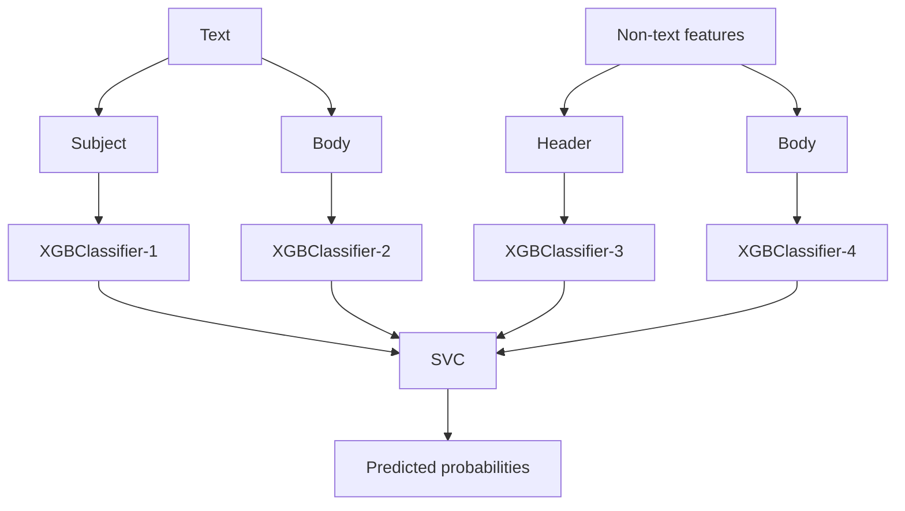
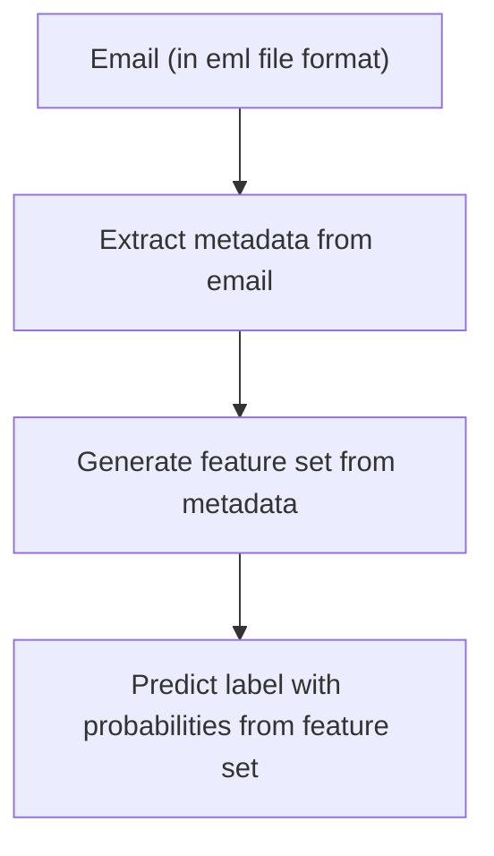
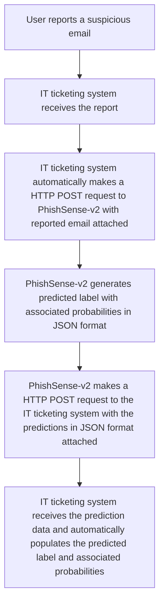

# Sniffing for Phishing

Authors: Ci Xu, Danish Karlin Isa, Jia Quan (Joseph) Lim, Lik Hang (Alex) Wong

This project is part of the coursework for DSCI 591 Capstone Project, a Master of Data Science course at the University of British Columbia.
This project is done in partnership with UBC Cybersecurity (the Partner).

## About

Currently, the Partner manually reviews suspicious emails reported by users – a process made difficult by the high-volume of reported emails and time sensitivity in addressing these threats.

This project aims to support the Partner in automating the existing review-to-recall workflow.
Our solution will enhance threat detection speed, reduce manual workload, and strengthen UBC’s cybersecurity.

The deliverables include a containerised web service consisting of a trained machine learning (ML) pipeline that classify reported emails, a dashboard for performance monitoring, and comprehensive documentation.

## PhishSense-v2

PhishSense-v2 contains an email classifier with a stacked architecture implemented using scikit-learn’s `StackingClassifier`. It comprises four `XGBClassifier` models whose predictions are combined by a final `SVC` to produce the final classification. The subject, body and extracted features (header and body) are passed as input and the output would be the probability of an email being `benign` and `malicious`.



### Machine learning pipeline

The following diagram describes the machine learning pipeline in PhishSense-v2.



### Incorporating PhishSense-v2 into current workflow

The following diagram describes how PhishSense-v2 can be integrated into the current workflow.



## Dependencies

- [Miniforge](https://conda-forge.org/miniforge/) for environment and package management
- [Quarto](https://quarto.org/docs/get-started/) with [TinyTeX](https://quarto.org/docs/output-formats/pdf-engine.html) and [Chromium or Google Chrome](https://quarto.org/docs/authoring/diagrams.html#chrome-install) for rendering reports
- [LanguageTool](https://dev.languagetool.org/http-server) and [OpenJDK](https://developers.redhat.com/products/openjdk/download) for generating features from emails
- All other dependencies listed in [environment.yml](environment.yml)

## Repository structure

The repository is structured as follows. Please create any missing folders to ensure that script outputs can be saved.

- `data/`:
Contains raw and processed datasets used for training and evaluation. This will also include the train test split of the dataset.

- `img/`:
Stores images used for documentation or reporting.

- `model/`:
Includes saved trained PhishSense-v2.

- `notebooks/`:
Contains Jupyter notebooks used for exploratory data analysis, prototyping, and documenting experiments throughout the project.

- `report/`:
Contains project documentation, such as the proposal and final report.

- `results/`:
Holds outputs from scripts, such as model selection result, cross-validation result, model evaluation result.

- `scripts/`:
Contains utility scripts for data processing, feature extraction, model training, prediction, and other automation tasks used throughout the project.

    | Script | Description |
    |--|-----|
    | `base_classifier_selection.py` | Selects and evaluates different base classifiers to determine which models perform best as components in the stacking ensemble. |
    | `build_features_df.py` | Extracts and processes features from email data, generating a DataFrame used for model training and prediction. |
    | `build_metadata_df.py` | Extracts metadata from raw email files and compiles it into a structured DataFrame for downstream processing. |
    | `generate_email_list.py` | Scans the dataset directory and generates a list of email file paths for use in model training and model testing. |
    | `generate_phishsense_metrics.py` | Computes and outputs evaluation metrics for the current PhishSense-1 model. |
    | `get_BERT_results.py` | Evaluate BERT models and saves the results. |
    | `model_architecture_selection.py` | Compares different stacking architectures to identify the most effective structure for the email classifier. |
    | `PhishSense-v2_results.py` | Aggregates and summarizes model evaluation results, such as performance metrics and confusion matrices. |
    | `predict_email.py` | Loads a trained model and predicts whether a given email is benign or malicious, outputting the results. |
    | `stacking_final_estimator_selection.py` | Selects and evaluates the final estimator (meta-classifier) used in the stacking ensemble. |
    | `train_model.py` | Trains the PhishSense-v2 model using the prepared dataset and saves the trained model for later use. |

- `src/`:
Contains the source code for the PhishSense-v2 application, including core modules for data processing, feature extraction, model training, prediction, and API service implementation.

    | Source Code | Description |
    |-|-----|
    | `app.py` | Main entry point for the PhishSense-v2 API service; handles HTTP requests and routes predictions. |
    | `content_features.py` | Extracts and processes features from the email content. |
    | `data_validation.py` | Validates input data and ensures correct formatting before processing. |
    | `feature_generation.py` | Combines and generates the full feature set required for model prediction. |
    | `header_features.py` | Extracts relevant features from email headers. |
    | `metadata_extraction.py`| Parses and extracts metadata from raw email files. |
    | `model_evaluation.py` | Provides utilities for evaluating model performance and generating metrics. |
    | `prediction.py` | Loads the trained model and performs predictions on processed email data. |

## Usage

The instructions in this section assumes that this project will be run on the provided virtual machine (VM).

It also assumes that the dataset of `eml` files reside on the VM at `/data/dataset/` with the following directory structure:

```md
/
└── data
    └── dataset
        ├── CEO_Fraud_-_Gift_Cards
        ├── CEO_Fraud_-_Payroll_Update
        ├── CEO_Fraud_-_Wire_Transfers
        ├── Legitimate_Email_Confirmed
        ├── Phishing_-_3rd_Party
        ├── Phishing_-_Outbound
        ├── Phishing_-_UBC
        ├── Phishing_UBC_-_Outbound
        ├── Reply_Chain_Attack
        ├── Self-Phishing
        ├── Spam_-_False_Positives
        ├── Spam_-_Inbound
        ├── Spam_-_Outbound
        └── Spearphishing
```

### Reset repository

> WARNING: We advice against resetting the repository to its default state as it is extremely time-consuming to generate the required datasets and results.

> NOTE: There is a known issue with rendering the proposal/final report, where Quarto is unable to render the PDF versions on the VM. To render the PDF version, you may have to do so on your Windows/MacOS device.

To reset the repository to its default state, run the following commands:

```bash {.code-overflow-wrap}
make remove_proposal
make remove_train_test_split
make remove_sampled_dataset
make remove_full_dataset
make remove_cached_dataset # this removes cached features that require an Internet and LanguageTool server connection
make remove_results
make remove_model
make remove_final-report
```

### Setup

1. Clone this GitHub repository onto the VM.

2. Open a command-line interface (CLI) and navigate to the root directory for this project.

3. Install and activate the environment using the following CLI commands:

    ```bash
    conda env create --f environment.yml
    conda activate phishsense-v2
    ```

4. Create a folder named `dependencies` in the root directory. 

5. Download and install the latest snapshot of LanguageTool according to the [installation instructions](https://dev.languagetool.org/http-server).
    - Unzip the downloaded folder inside `dependencies` folder.
    - During installation for fastText language identification model, download `lid.176.bin` model.
    - Remember to create the `server.properties` as per the installation instructions.

6. Once LanguageTool is installed, navigate to the directory that LanguageTool is installed in and start the LanguageTool HTTP server using the following CLI command:

    ```bash {.code-overflow-wrap}
    cd PATH_TO_LANGUAGETOOL_DIRECTORY
    java -cp languagetool-server.jar org.languagetool.server.HTTPServer --config server.properties --port 8081 --allow-origin
    ```

    Note that PhishSense-v2 sends HTTP requests to the LanguageTool server using `localhost` at port `8081`.
    If you wish to use a different port number or host a LanguageTool server using a domain other than `localhost`, you must specify the URL within `scripts/build_features.df`.

    We recommend using [`screen`](https://www.gnu.org/software/screen/) to spin up a persistent instance of the LanguageTool HTTP server.

### Generate model

1. Split the dataset into train, test and downsampled train sets:

    ```bash
    make train_test_split
    ```

2. Generate the data required for training:

    ```bash
    make full_dataset
    ```

    > NOTE: This step requires an Internet connection and the LanguageTool HTTP server to be running.
    This will be a time-consuming step as it involves checking of name servers for every email.
    We recommended appending `nohup` to the command provided to ensure that the script still runs even when the CLI is closed, or when the user is logged out.

3. Once the data is successfully generated, generate the model object:

    ```bash
    make model
    ```

4. The model will be available in the `model` subdirectory as a pickle file (`phishsense-v2.pkl`).

### Predict email

Run the following CLI command:

```bash {.code-overflow-wrap}
conda activate phishsense-v2
python scripts/predict_email.py --email_path PATH_TO_EML_FILE --model_path PATH_TO_MODEL_PKL --show y
```

Note that you must have generated `PhishSense-v2.pkl` before running the CLI command above.

### Render proposal

Run the following CLI command:

```bash
make proposal
```

The proposal will be available in the `report/proposal/` subdirectory as a HTML and PDF file.

### Render final report

1. Split the dataset into train, test and downsampled train sets
(you may skip this if you did it when generating the model):

    ```bash
    make train_test_split
    ```

2. Generate the required data:

    ```bash
    make sampled_dataset
    make full_dataset   # you may skip this if you did it when generating the model
    ```

    > NOTE: This step requires an Internet connection and the LanguageTool HTTP server to be running.
    This will be a time-consuming step as it involves checking of name servers for every email.
    We recommended appending `nohup` to the command provided to ensure that the script still runs even when the CLI is closed, or when the user is logged out.

3. Generate the model object for PhishSense-v2:

    ```bash
    make model
    ```

4. Generate the results required for the final report:

    ```bash
    make results
    ```

5. Render the final report:

    ```bash
    make final_report
    ```

    The final report will be available in the `report/final-report/` subdirectory as a HTML and PDF file.

### Viewing the proposal/final report

While viewing the proposal and final report in PDF is possible, we recommend viewing the proposal and final report in HTML format:

1. Open this repository with all the generated results in VSCode.

2. Install the [Live Preview](https://marketplace.visualstudio.com/items?itemName=ms-vscode.live-server) extension in VSCode.

3. Right click on the `html` file and select `Show Preview`.

4. You may either view the report in the web browser within VSCode, or copy the link and view it in your web browser.

## PhishSense-v2 API

The following documentation provide the guide to host the PhishSense-v2 API.

### How to host the API

#### Step 1 (optional): Build the container image

If container image is not present, run the following command in the terminal from the root directory of this repository.

```bash
sudo TMPDIR=/tmp podman build --network=host --tag PhishSense-v2 .
```

#### Step 2: Run the service

There are two options to run the service from the root directory of this repo.

- Run the following CLI command:

    ``` bash
    sudo podman run --network=host -v ./model:/app/model:ro localhost/PhishSense-v2
    ```

    Ensure that the necessary mount required volumes are passed as arguments. The volumes used are directories that exist in the Virtual Machine.

- Run the following CLI command:

    ```bash
    sudo podman-compose up
    ```

### API Usage

#### Endpoint

```bash
POST /predict
```

#### Supported input methods

The API takes in two different file formats:

1. An `eml` file, or multiple `eml` files with `-F` tags:

    ```bash
    curl -X POST http://localhost:5000/predict "email_file=@PATH_TO_EML_FILE" # for single eml file

    curl -X POST http://localhost:5000/predict \
        -F "email_file=@PATH_TO_EML_FILE_1" \
        -F "email_file=@PATH_TO_EML_FILE_2"     # for multiple eml files
    ```

2. `zip` folder that contains multiple `eml` files:

    ```bash
    curl -X POST http://localhost:5000/predict -F "email_zip=@PATH_TO_ZIP_FILE"
    ```

#### Sample output

The response consists of a JSON containing the probability that an email is `benign` and `malicious` (both sums to 1).

```json
[
    {
    "filename":"0_message.eml",
    "prediction":{
            "probability":{
                "benign":0.7422,
                "malicious":0.2577
            }
        }
    },
    ...
]
```

## License

© 2025 The University of British Columbia.
